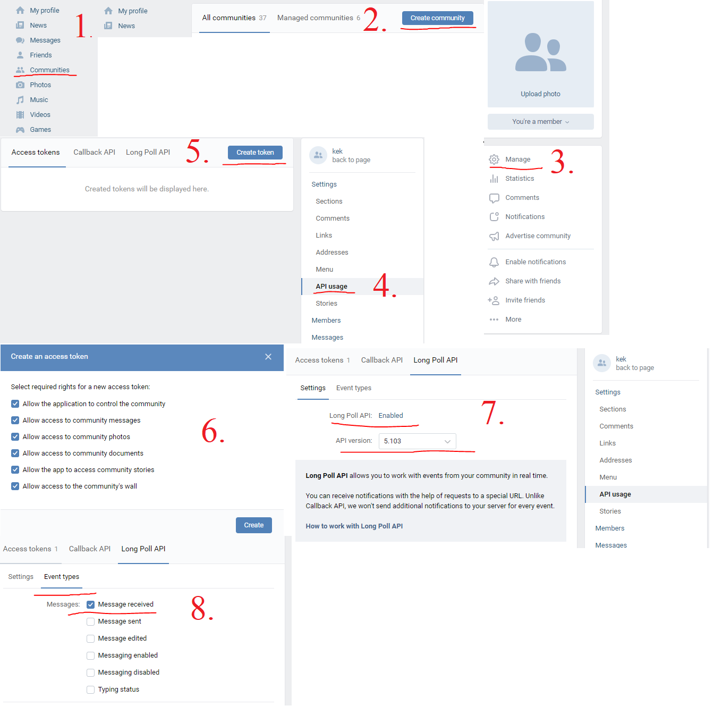
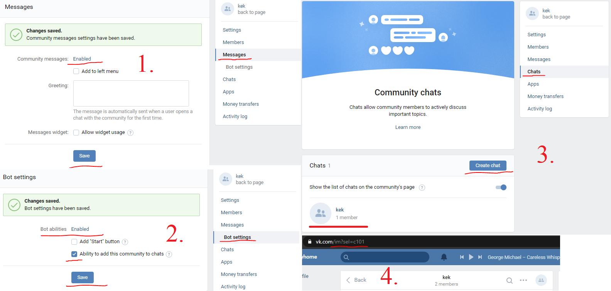
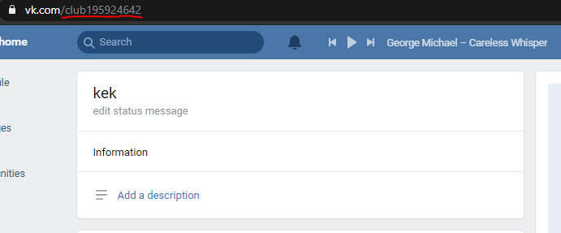
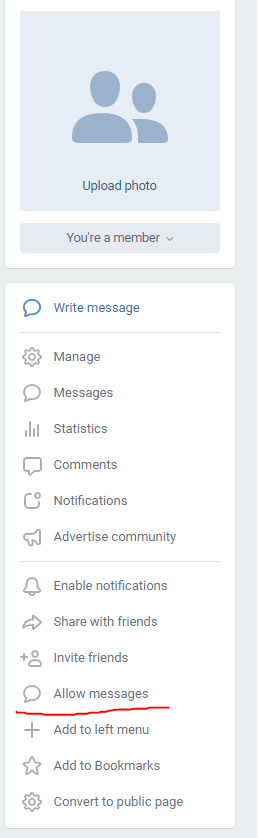

# Bot using Long-Polling

This is a simple echo bot - it sends back what it received. He works in a telegram and in VK.

## How to install

### Step 1 - config changes

#### src/Config.json.

```json
{ "bot":"vk"
, "repeatN":1
, "repeatMsg":"At the moment, I repeat what you said times. Press the button with the number, with the desired number of repetitions."
, "helpMsg":"Hey. I am a simple echo-bot - I write back what they wrote to me. If you want to change how many times I reply to one of your messages, then write /repeat "
, "logLevel":"DEBUG"
}
```

##### Details of Config.json

1. bot: the name of the selected bot, must match the name in the src/Bot folder.
2. repeatN: the value is the initial number of bot retries per message.
3. repeatMsg, helpMsg:
   - repeatMsg: this is a message that is sent in response to the /repeat command.
   - helpMsg: this is a message that is sent in response to the /help command.
4. logLevel: during the execution of the program, on the passage of key and not only moments, logs will be sent to the console. Only 4 levels: DEBUG, INFO, WARNING, ERROR.
   - DEBUG is the most insignificant.
   - INFO - reports on key points.
   - WARNING - warns of possible errors.
   - ERROR - indicates a critical error, which prevents further execution.
DEBUG < INFO < WARNING < ERROR. Thus, by entering a certain level of logging into the value of the "logLevel" field, the application will send logs whose level is either equal to or higher than the specified level.


#### VK Bot

Create this file at the specified path using the data below.
- src/Bot/Vk/Vk.json

```json
{ "start_request":
    { "path":"https://api.vk.com/method/groups.getLongPollServer"
    , "params":
        [ "group_id"
        , "access_token"
        , "v"
        ]
    , "got":"response"
    }
, "ask_request":
    { "path":"<server>"
    , "params":
        [ "act"
        , "key"
        , "wait"
        , "mode"
        , "ts"
        ]
    , "got":"updates"
    }
, "send_request":
    { "path":"https://api.vk.com/method/messages.send"
    , "params":
        [ "user_id"
        , "random_id"
        , "peer_id"
        , "message"
        , "attachment"
        , "access_token"
        , "v"
        ]
    }
, "act":"a_check"
, "wait":25
, "mode":2
, "msgField":"message"
, "access_token":""
, "keyboard":
    { "keyboard":"{\"one_time\":true,\"buttons\":[[{\"action\":{\"type\":\"text\",\"payload\":\"{\\\"button\\\": \\\"1\\\"}\",\"label\":\"1\"},\"color\":\"primary\"},{\"action\":{\"type\":\"text\",\"payload\":\"{\\\"button\\\": \\\"1\\\"}\",\"label\":\"2\"},\"color\":\"primary\"},{\"action\":{\"type\":\"text\",\"payload\":\"{\\\"button\\\": \\\"1\\\"}\",\"label\":\"3\"},\"color\":\"primary\"},{\"action\":{\"type\":\"text\",\"payload\":\"{\\\"button\\\": \\\"1\\\"}\",\"label\":\"4\"},\"color\":\"primary\"},{\"action\":{\"type\":\"text\",\"payload\":\"{\\\"button\\\": \\\"1\\\"}\",\"label\":\"5\"},\"color\":\"primary\"}]]}"
    }
, "peer_id":
, "group_id":
, "v":"5.103"
}
```

To work VK bot you must have 3 fields correctly filled in: access_token, peer_id, group_id.
1. access_token: this is the access token.
   - [This is the documentation for receiving it.](https://vk.com/dev/bots_docs?f=1.1.%20%D0%9F%D0%BE%D0%BB%D1%83%D1%87%D0%B5%D0%BD%D0%B8%D0%B5%20%D0%BA%D0%BB%D1%8E%D1%87%D0%B0%20%D0%B4%D0%BE%D1%81%D1%82%D1%83%D0%BF%D0%B0)
   - However, the easiest way to get it is through the community. To do this, of course, you need to be registered.
     - Then click on "Communities".
     - "Create community"
     - "Manage"
     - "API usage" and "Create token"
     - Now you need to choose what you can do using this token. Select 1 and 2: "Allow the application to control the community" and "Allow access to community messages", so that the bot can send messages to users. Creating a token is very important, as it can be used for hacking. Therefore, you have to confirm its creation, for example, using push notification on the phone.
     - Copy it and paste between double quotes in MyConfig.json, as the value of the access_token field. Remember to activate the LongPoll API and synchronize the version of the API with the "v" field in MyConfig.json. For everything to work correctly, put "API version: 5.103". Since it was everything that was created on it.
     - It is also very important which events are activated - the server will respond to your json request with event information. Since this is an echo bot, activate only "Message received".

2. peer_id: this is an equally important parameter, the identifier of the conversation.
   - Bots need community permission to send messages. And his conversation.
   - Then create a chat. And enter it by clicking on the icon.
   - After they entered the chat, a number appeared in the address bar. We only need a number. In my example, this is the number 101. It needs to be entered between double quotes as the value of the peer_id field.

3. group_id: This is the easiest, go to your community and there will be a number in the address bar.


#### Telegram Bot

Create this file at the specified path using the data below.
- src/Bot/Telegram/Telegram.json

```json
{ "start_request":
    { "path":"https://api.telegram.org/bot<access_token>/getUpdates"
    , "params":
        [ "timeout"
        ]
    , "got":"result"
    }
, "ask_request":
    { "path":"https://api.telegram.org/bot<access_token>/getUpdates"
    , "params":
        [ "timeout"
        , "offset"
        ]
    , "got":"result"
    }
, "send_request":
    { "path":"https://api.telegram.org/bot<access_token>/sendMessage"
    , "params":
        [ "chat_id"
        , "text"
        ]
    }
, "timeout":30
, "access_token":""
, "keyboard":
    { "reply_markup":"{\"keyboard\":[[{\"text\":\"1\"},{\"text\":\"2\"},{\"text\":\"3\"},{\"text\":\"4\"},{\"text\":\"5\"}]],\"resize_keyboard\":true,\"one_time_keyboard\":true}"
    }
, "msgField":"text"
}
```

For the telegram bot to work, you must fill out access_token.
The telegram documentation describes well how to get the values you need, so [here](https://tlgrm.ru/docs/bots).
If you have problems with the documentation, then just write this bot in a telegram - [@BotFather](https://tele.gs/botfather) .

##### Details of <Bot>.json

###### General data:

1. start_request: request to start a session.
2. path: path of request.
3. params: params of request.
4. got: in response, they usually send json, which has a "login field".
5. ask_request: request to get updates - messages.
6. timeout/wait: waiting time for a response.
7. access_token: key parameter for sending API requests.
8. keyboard: this field contains the field that corresponds to the parameter for the API and the json object written as a string. This is the keyboard that becomes visible if you write the /repeat command to the bot. If you want to change it, check out the template at the appropriate API and you can use [this site](https://tools.knowledgewalls.com/jsontostring) to converte json to string.
9. msgField: each API has its own message field in the json response. When creating a request, the bot looks for the required parameters in the config, so it is important to know the name of the message parameter.

###### Optional data

Vk bot
    - act, mode: these are standard values ​​taken from the documentation, do not touch them.
    - v: When I started making the bot, the version was 5.103. Since when the API version changes, the methods and parameters, and even more the json response fields, may change, I do not advise you to touch this field.

### Step 2 - building and testing
In the root folder of the repository, open git bash and write the following commands.
```git
$ stack build
```
And after successfully assembling. This way you will do a little check.
```git
$ stack test
```
If problems arise at this or subsequent stages. I left my contacts it the end README.

### Step 3 - explanation of work

#### Vk

The logic of the beginning of correspondence is this: since the bot writes to the user on behalf of the community, the user must allow this community to send messages to him. After the user writes a message to the general community conversation that you created in the first step, the bot will send you an answer to the new correspondence that he created for you. Now you can chat with him using the new correspondence. To change the bot that you want to run, just change its name in MyConfig.json.


#### Telegram

For telegrams of the bot, after starting the bot with the command below. You just need to write to the bot. To find it, you need to use the name you gave it when you created it.

You can start the application from git bash with this line.
```git
$ stack exec bot-exe
```
To stop an application launched in this way, first select the git bash window as the active one and press crtl + c.
If you closed git bash before the application stopped, then it will continue to work until you shut it down, for example, through the task manager.
Also after the assembly bot-exe.exe appeared, it is located in bot\.stack-work\install\a752600e\bin.

## Architecture

### Modules

* src/Config.hs - config is collecting by ```haskell setConfig :: IO ()```

### Adding new bots

## Packages

* [random](https://hackage.haskell.org/package/random) - Almost all requests require a random identifier.
* [aeson](https://hackage.haskell.org/package/aeson) - For unpacking and packaging json, as well as for tests.
* [bytestring](https://hackage.haskell.org/package/bytestring) - For the correct reading of json from the file and sending requests.
* [http-client](https://hackage.haskell.org/package/http-client),[http-conduit](https://hackage.haskell.org/package/http-conduit) - Libraries for http requests, [Tutorial](https://github.com/snoyberg/http-client/blob/master/TUTORIAL.md)
* [text](https://hackage.haskell.org/package/text) - For wrapping strings to use functions from aeson.
* [HUnit](https://hackage.haskell.org/package/HUnit) - It’s easy to write tests with this.
* [vector](https://hackage.haskell.org/package/vector), [unordered-containers](https://hackage.haskell.org/package/unordered-containers) - For constructing Value from aeson.
* [transformers](https://hackage.haskell.org/package/transformers) - For architecture.
* [directory](https://hackage.haskell.org/package/directory) - To read the config regardless of the position of the repository on disk.

## Authors

* **Misha Snisarenko**
My email - mishasnis@gmail.com
